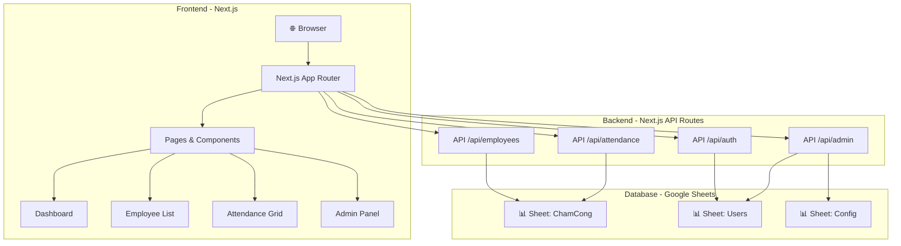

# Web App Quản Lý Nhân Sự & Chấm Công - Plating Department

## Tổng quan

Xây dựng web app quản lý nhân sự và chấm công cho bộ phận Plating, sử dụng **Google Sheets** làm database và **Next.js (Node.js)** làm frontend/backend. Hệ thống hỗ trợ phân quyền Leader/Admin.

> [!IMPORTANT]
> **Github** git@github.com:Dzungdev87/PlatingHR.git
> **Google Sheet gốc**: [CHAM CONG PLATING](https://docs.google.com/spreadsheets/d/1jfptNRiZH_pWYI1nhYiubl-3xzLAwM_ew0GwyDlao_o/edit?usp=sharing)

---

## Phân tích dữ liệu Google Sheet hiện tại

### Cấu trúc sheet "CHẤM CÔNG PLATING"

| Cột | Nội dung |
|-----|----------|
| A | STT/No |
| B | Mã NV (Emp. No.) — VD: B4485, B4626... |
| C | Họ và tên (Full name) |
| D → AG | Ngày 1–30 trong tháng (chấm công) |

### Các loại ca làm việc (Shift Types)

| Mã | Loại ca | Thời lượng |
|----|---------|-----------|
| **C1** | Ca ngày | 8h |
| **C2** | Ca ngày | 8h |
| **C3** | Ca đêm | 8h |
| **TS** | Ca đêm | 12h |
| **X** | Ca ngày | 12h |
| **V** | Ca ngày | 8h |
### Các loại nghỉ (Leave Types)

| Mã | Loại nghỉ |
|----|----------|
| **AL** | Nghỉ phép (Annual Leave) |
| **UP** | Nghỉ không lương (Unpaid Leave) |
| **SL** | Nghỉ ốm (Sick Leave) |
| **WL** | Nghỉ kết hôn (Wedding Leave) |
| **OL** | Nghỉ khác (Other Leave) |

### Nhân viên hiện tại: **47 người** (B4485 → B5729)

---

## User Review Required

> [!WARNING]
> **Google Sheets có giới hạn**: Tối đa ~500 requests/100 giây/project. Với 47 nhân viên hiện tại thì đủ, nhưng nếu mở rộng >100 người nên cân nhắc chuyển sang database thực sự.

## Quyết định đã xác nhận

- ✅ **Xác thực**: Phương án A — Đăng nhập bằng **Mã NV + Mật khẩu** (lưu trong Google Sheet)
- ✅ **Mật khẩu mặc định Leader**: `123`
- ✅ **Mật khẩu mặc định Admin**: `123456`
- ✅ **Leader được chấm công**: Tất cả công nhân trong ca cho ngày hôm nay và ngày hôm trước
- ✅ **Admin chấm công**: Mọi ngày, mọi nhân viên

## Open Questions

1. **Ngôn ngữ giao diện**: Tiếng Việt hoàn toàn hay song ngữ Việt-Anh?
2. **Hosting**: Deploy ở đâu? (Vercel miễn phí, hoặc server nội bộ?)
3. **Tính năng bổ sung**: Có cần xuất báo cáo Excel/PDF không?

---

## Kiến trúc hệ thống



---

## Cấu trúc Google Sheets (Đề xuất mở rộng)

### Sheet 1: "ChamCong" (Sheet gốc hiện tại)
Giữ nguyên cấu trúc hiện tại, app sẽ đọc/ghi trực tiếp.

### Sheet 2: "Users" (Tạo mới)
| Cột | Tên | Mô tả |
|-----|-----|-------|
| A | empId | Mã NV (B4485...) |
| B | fullName | Họ tên |
| C | password | Mật khẩu (hashed) |
| D | role | `admin` hoặc `leader` |
| E | shift | Ca làm việc quản lý (nếu là Leader: C1/C2/C3...) |
| F | team | Tổ / Nhóm (nếu có) |
| G | email | Email (tuỳ chọn) |
| H | phone | SĐT (tuỳ chọn) |
| I | department | Bộ phận (Plating) |
| J | position | Chức vụ |
| K | joinDate | Ngày vào làm |
| L | status | `active` / `inactive` |

### Sheet 3: "Config" (Tạo mới)
| Cột | Tên | Mô tả |
|-----|-----|-------|
| A | key | Tên cấu hình |
| B | value | Giá trị |

Ví dụ: `currentMonth=6`, `currentYear=2026`, `defaultShift=C1`

---

## Proposed Changes

### Cấu trúc thư mục dự án

```
d:\4. Study\4. Study Code\12DiemdanhPlating\
├── .env.local                    # Google Sheets API keys
├── next.config.js
├── package.json
├── public/
│   └── favicon.ico
├── src/
│   ├── app/
│   │   ├── layout.js             # Root layout + font + theme
│   │   ├── page.js               # Landing → redirect to /dashboard
│   │   ├── globals.css           # Design system CSS
│   │   ├── login/
│   │   │   └── page.js           # Trang đăng nhập
│   │   ├── dashboard/
│   │   │   └── page.js           # Dashboard tổng quan
│   │   ├── employees/
│   │   │   ├── page.js           # Danh sách nhân viên
│   │   │   └── [id]/
│   │   │       └── page.js       # Chi tiết nhân viên
│   │   ├── attendance/
│   │   │   └── page.js           # Bảng chấm công
│   │   └── admin/
│   │       ├── page.js           # Quản lý user
│   │       └── settings/
│   │           └── page.js       # Cài đặt hệ thống
│   ├── components/
│   │   ├── Sidebar.js            # Thanh menu bên trái
│   │   ├── Header.js             # Header + user info
│   │   ├── AttendanceGrid.js     # Bảng chấm công dạng lưới
│   │   ├── EmployeeCard.js       # Card nhân viên
│   │   ├── ShiftBadge.js         # Badge hiển thị ca
│   │   ├── StatsCard.js          # Card thống kê
│   │   ├── Modal.js              # Modal component
│   │   └── ProtectedRoute.js     # HOC kiểm tra quyền
│   ├── lib/
│   │   ├── googleSheets.js       # Google Sheets API client
│   │   ├── auth.js               # Authentication logic
│   │   └── constants.js          # Shift types, leave types
│   └── api/
│       ├── auth/
│       │   ├── login/route.js    # POST /api/auth/login
│       │   └── logout/route.js   # POST /api/auth/logout
│       ├── employees/
│       │   └── route.js          # GET, POST /api/employees
│       ├── attendance/
│       │   └── route.js          # GET, PUT /api/attendance
│       └── admin/
│           └── route.js          # Admin-only endpoints
```

---

### Component 1: Project Setup & Configuration

#### [NEW] package.json
- Next.js 14+ (App Router)
- Dependencies: `googleapis`, `next-auth` hoặc `jose` (JWT), `bcryptjs`

#### [NEW] .env.local
- `GOOGLE_SHEETS_ID` — ID của Google Sheet
- `GOOGLE_SERVICE_ACCOUNT_EMAIL` — Service Account email
- `GOOGLE_PRIVATE_KEY` — Service Account private key  
- `JWT_SECRET` — Secret cho JWT token
- `NEXT_PUBLIC_APP_NAME` — Tên app

#### [NEW] next.config.js
- Cấu hình Next.js cơ bản

---

### Component 2: Google Sheets API Integration

#### [NEW] src/lib/googleSheets.js
- Kết nối Google Sheets API v4 bằng Service Account
- Các hàm CRUD:
  - `getSheetData(sheetName, range)` — Đọc dữ liệu
  - `updateSheetData(sheetName, range, values)` — Cập nhật dữ liệu
  - `appendSheetData(sheetName, values)` — Thêm dòng mới
  - `deleteSheetRow(sheetName, rowIndex)` — Xoá dòng

#### [NEW] src/lib/constants.js
```javascript
export const SHIFT_TYPES = {
  C1: { label: 'Ca ngày 8h', hours: 8, type: 'day', color: '#4CAF50' },
  C2: { label: 'Ca ngày 8h', hours: 8, type: 'day', color: '#2196F3' },
  C3: { label: 'Ca đêm 8h', hours: 8, type: 'night', color: '#9C27B0' },
  TS: { label: 'Ca đêm 12h', hours: 12, type: 'night', color: '#FF5722' },
  X:  { label: 'Ca ngày 12h', hours: 12, type: 'day', color: '#FF9800' },
};

export const LEAVE_TYPES = {
  AL: { label: 'Nghỉ phép', color: '#00BCD4' },
  UP: { label: 'Nghỉ không lương', color: '#607D8B' },
  SL: { label: 'Nghỉ ốm', color: '#F44336' },
  WL: { label: 'Nghỉ kết hôn', color: '#E91E63' },
  OL: { label: 'Nghỉ khác', color: '#795548' },
};
```

---

### Component 3: Authentication & Authorization

#### [NEW] src/lib/auth.js
- Hàm `hashPassword(password)` / `verifyPassword(password, hash)`
- Hàm `generateToken(user)` / `verifyToken(token)` dùng JWT
- Middleware `withAuth(handler)` — kiểm tra token
- Middleware `withAdmin(handler)` — kiểm tra quyền admin

#### [NEW] src/app/api/auth/login/route.js
```
POST /api/auth/login
Body: { empId, password }
Response: { token, user: { empId, fullName, role } }
```

#### Phân quyền chi tiết

| Tính năng | Leader (Tổ trưởng) | Admin |
|-----------|:------------------:|:-----:|
| Xem dashboard tổng quan | ✅ | ✅ |
| Xem lịch chấm công (toàn bộ) | ✅ | ✅ |
| Xem danh sách nhân viên | ✅ | ✅ |
| Chấm công **hôm nay & hôm qua** (mọi công nhân trong ca) | ✅ | ✅ |
| Chấm công **mọi ngày, mọi nhân viên** | ❌ | ✅ |
| Thêm/sửa/xoá nhân viên | ❌ | ✅ |
| Quản lý tài khoản users | ❌ | ✅ |
| Xem báo cáo tổng hợp | ❌ | ✅ |
| Cài đặt hệ thống | ❌ | ✅ |

#### Mật khẩu mặc định

| Role | Mật khẩu mặc định | Ghi chú |
|------|:------------------:|--------|
| **Leader** | `123` | Tài khoản cho các Tổ trưởng |
| **Admin** | `123456` | Tài khoản quản trị viên |

> [!TIP]
> Người dùng có thể đổi mật khẩu sau khi đăng nhập lần đầu.

#### Logic chấm công theo role

```
Khi Leader click ô chấm công:
  ├─ Kiểm tra: ngày đó có phải hôm nay hoặc hôm qua?
  │   ├─ CÓ → Cho phép chọn ca / loại nghỉ cho bất kỳ công nhân nào trong ca
  │   └─ KHÔNG → Từ chối, hiển thị "Chỉ được chấm công hôm nay và hôm qua"
  └─ Ghi dữ liệu vào Google Sheet

Khi Admin click ô chấm công:
  ├─ Cho phép chọn bất kỳ nhân viên nào
  ├─ Cho phép chọn bất kỳ ngày nào trong tháng
  └─ Ghi dữ liệu vào Google Sheet
```

---

### Component 4: UI/UX Design System

#### [NEW] src/app/globals.css
- **Theme**: Dark mode chủ đạo với accent xanh dương (#2196F3)
- **Font**: Inter (Google Fonts)
- **Design tokens**: Colors, spacing, border-radius, shadows
- **Glassmorphism**: Cards với backdrop-filter blur
- **Animations**: Fade-in, slide-up, hover effects

#### Wireframe các trang chính

**1. Login Page**
```
┌──────────────────────────────────┐
│          🏭 PLATING HR          │
│                                  │
│    ┌──────────────────────┐     │
│    │  Mã nhân viên        │     │
│    └──────────────────────┘     │
│    ┌──────────────────────┐     │
│    │  Mật khẩu            │     │
│    └──────────────────────┘     │
│    ┌──────────────────────┐     │
│    │   ĐĂNG NHẬP ▶        │     │
│    └──────────────────────┘     │
└──────────────────────────────────┘
```

**2. Dashboard**
```
┌────┬───────────────────────────────┐
│    │  Dashboard              👤    │
│ 📊 │  ┌─────┐ ┌─────┐ ┌─────┐    │
│ 👥 │  │47 NV│ │Đi làm│ │Nghỉ │    │
│ 📅 │  └─────┘ └─────┘ └─────┘    │
│ ⚙️ │                               │
│    │  📊 Biểu đồ chấm công tuần   │
│    │  ┌───────────────────────┐    │
│    │  │ ▓▓▓▓▓░░▓▓▓▓▓░░▓▓▓   │    │
│    │  └───────────────────────┘    │
│    │                               │
│    │  🕐 Hoạt động gần đây        │
│    │  • B4485 - Chấm công C1      │
│    │  • B4626 - Nghỉ phép AL      │
└────┴───────────────────────────────┘
```

**3. Attendance Grid (Bảng chấm công)**
```
┌────┬───────────────────────────────────┐
│    │  Chấm công    [Tháng 6 ▼] 2026   │
│    │  ┌────┬────┬──┬──┬──┬──┬──┬──┐   │
│    │  │ NV │Tên │ 1│ 2│ 3│ 4│ 5│..│   │
│    │  ├────┼────┼──┼──┼──┼──┼──┼──┤   │
│    │  │4485│Dũng│C1│C1│C1│C1│C1│  │   │
│    │  │4626│Bách│C2│C2│AL│C2│C2│  │   │
│    │  │4134│Hà  │C1│SL│C1│C1│C1│  │   │
│    │  └────┴────┴──┴──┴──┴──┴──┴──┘   │
│    │  [C1] [C2] [C3] [TS] [X]  Legend  │
└────┴───────────────────────────────────┘
```

---

### Component 5: Các trang chính

#### [NEW] src/app/page.js
- Redirect tới `/login` nếu chưa đăng nhập, `/dashboard` nếu đã đăng nhập

#### [NEW] src/app/login/page.js
- Form đăng nhập: Mã NV + Mật khẩu
- Thiết kế glassmorphism, gradient background
- Lưu JWT token vào httpOnly cookie

#### [NEW] src/app/dashboard/page.js
- **Admin**: Thống kê tổng quan toàn nhà máy (tổng NV, số người đi làm hôm nay, nghỉ, ca đêm, biểu đồ...)
- **Leader**: Thống kê ca/tổ quản lý (số lượng công nhân trong ca, số đi làm hôm nay, số vắng mặt, tỷ lệ chuyên cần)
- Biểu đồ chấm công tuần/tháng (dùng Canvas API)
- Hoạt động gần đây

#### [NEW] src/app/employees/page.js
- Danh sách nhân viên dạng table/card
- Search theo tên/mã NV
- Filter theo trạng thái (active/inactive)
- Admin: nút Thêm/Sửa/Xoá nhân viên

#### [NEW] src/app/attendance/page.js
- **Bảng chấm công dạng lưới** (grid) — giống Excel
- Chọn tháng/năm để xem
- **Leader**: Click ô của bất kỳ công nhân nào trong ca, chỉ ngày hôm nay & hôm qua → mở dropdown chọn ca
- **Admin**: Click bất kỳ ô nào, mọi ngày → mở dropdown chọn ca
- Ô không được phép chỉnh sửa hiển thị cursor disabled + tooltip giải thích
- Color-coded theo loại ca/nghỉ
- Tổng hợp cuối mỗi hàng (tổng ngày làm, giờ, nghỉ)

#### [NEW] src/app/admin/page.js
- Quản lý tài khoản user (CRUD)
- Reset mật khẩu
- Phân quyền admin/leader

---

### Component 6: Shared Components

#### [NEW] src/components/Sidebar.js
- Menu dọc bên trái, icon + text
- Highlight trang hiện tại
- Collapse trên mobile
- Menu items tuỳ theo role

#### [NEW] src/components/AttendanceGrid.js
- Grid chấm công interactive
- Mỗi ô hiển thị mã ca với màu tương ứng
- **Leader**: click ô của bất kỳ công nhân nào trong ca (chỉ hôm nay & hôm qua) → dropdown chọn ca
- **Admin**: click bất kỳ ô nào, mọi ngày → dropdown chọn ca
- Ô bị khoá: hiển thị 🔒 icon + cursor `not-allowed` + tooltip "Không có quyền"
- Tooltip hiển thị chi tiết khi hover
- Sticky header (ngày) và sticky column (tên NV)

#### [NEW] src/components/ShiftBadge.js
- Badge nhỏ hiển thị mã ca với màu phân biệt
- Hover effect hiển thị thông tin ca

---

## Các bước triển khai (Timeline)

### Phase 1: Setup & Foundation (Ngày 1-2)
- [ ] Khởi tạo Next.js project
- [ ] Cấu hình Google Sheets API (Service Account)
- [ ] Tạo Google Sheets thêm sheet "Users" và "Config"
- [ ] Xây dựng `googleSheets.js` library
- [ ] Thiết lập design system (`globals.css`)

### Phase 2: Authentication (Ngày 3)
- [ ] Xây dựng API đăng nhập/đăng xuất
- [ ] Tạo trang Login UI
- [ ] Middleware kiểm tra auth + role
- [ ] Protected routes

### Phase 3: Core Features (Ngày 4-6)
- [ ] Dashboard page (Admin + Leader views)
- [ ] Employee list page
- [ ] Attendance grid page
- [ ] API endpoints cho employees & attendance

### Phase 4: Admin Features (Ngày 7-8)
- [ ] Admin panel - quản lý user
- [ ] CRUD nhân viên
- [ ] Chấm công trực tiếp trên grid
- [ ] Cài đặt hệ thống

### Phase 5: Polish & Deploy (Ngày 9-10)
- [ ] Responsive design (mobile)
- [ ] Animations & transitions
- [ ] Error handling
- [ ] Testing
- [ ] Deploy lên Vercel

---

## Verification Plan

### Automated Tests
- Chạy `npm run build` để kiểm tra build thành công
- Chạy `npm run dev` và kiểm tra các trang trên trình duyệt
- Test API endpoints bằng cách gọi trực tiếp từ browser/Postman

### Manual Verification
- Đăng nhập với tài khoản admin và leader để kiểm tra phân quyền
- Chấm công thử và xác nhận dữ liệu cập nhật trên Google Sheet
- Kiểm tra responsive trên mobile
- Kiểm tra các edge case: mật khẩu sai, token hết hạn, mã NV không tồn tại

---

## Tech Stack Summary

| Layer | Technology |
|-------|-----------|
| **Frontend** | Next.js 14 (App Router) |
| **Styling** | Vanilla CSS (Glassmorphism + Dark mode) |
| **Font** | Inter (Google Fonts) |
| **Backend** | Next.js API Routes |
| **Database** | Google Sheets API v4 |
| **Auth** | JWT (jose) + bcryptjs |
| **Deploy** | Vercel (miễn phí) |
| **API Client** | googleapis npm package |
